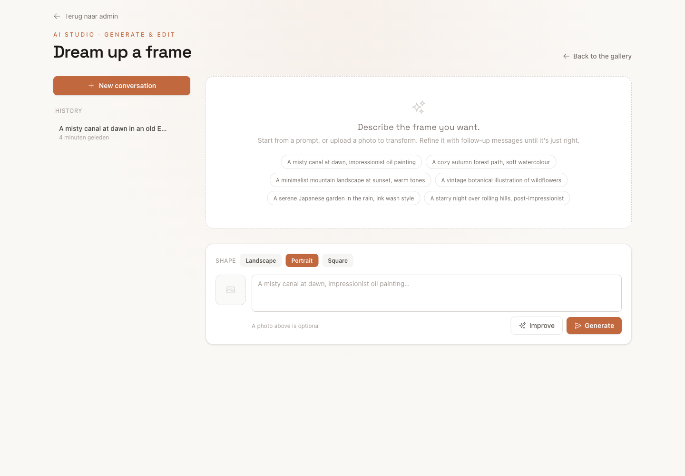
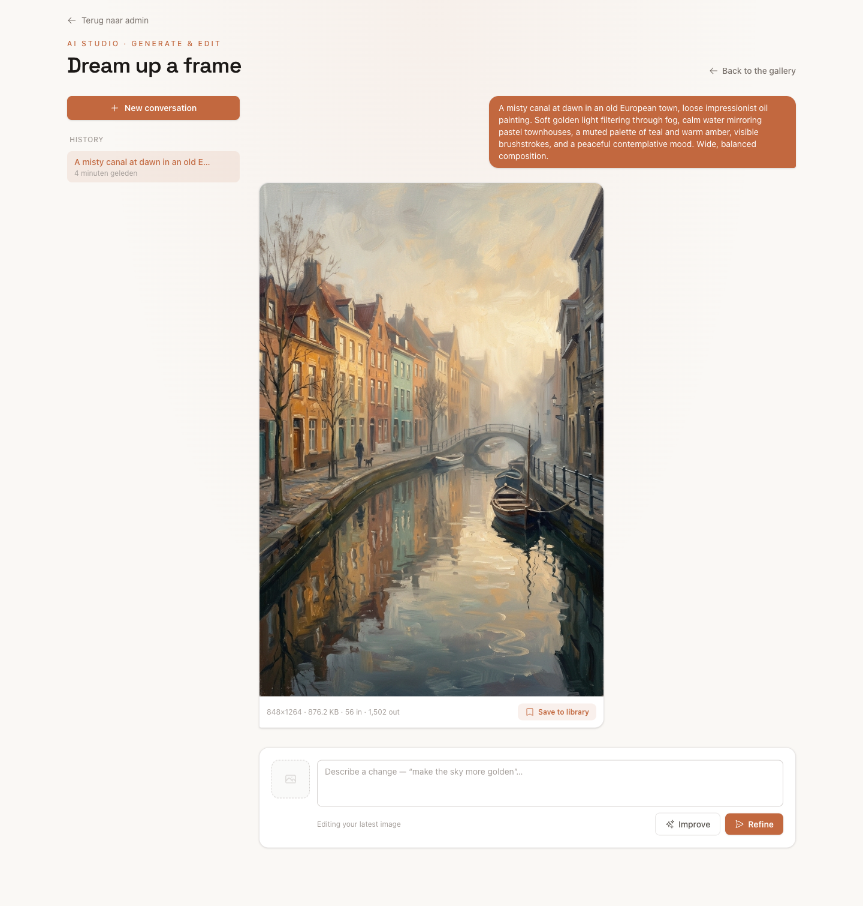

# Laravel SwitchBot AI Art Frame


[](https://packagist.org/packages/spaanproductions/laravel-switchbot-frame)
[](https://github.com/spaanproductions/laravel-switchbot-frame/actions/workflows/run-tests.yml)

A standalone Laravel + Livewire admin page for the [SwitchBot AI Art Frame](https://eu.switch-bot.com/products/switchbot-ai-art-frame).
Upload photos, optimize them for the E Ink Spectra 6 panel, push them to the frame, and read the real
battery level from SwitchBot's change-report webhook — all from one self-contained page that ships its
own compiled CSS, so it does not depend on your application's Tailwind build. Optionally, generate and
iteratively edit art with AI right from the page (see [AI Image Studio](#ai-image-studio)).

## Requirements

- PHP 8.4+
- Laravel 12 or 13, Livewire 4
- `ext-gd` (image optimization); `ext-exif` recommended (phone-photo orientation)
- `laravel/sanctum` for the default `auth:sanctum` middleware (or change the middleware in the config)
- `laravel/ai` *(optional)* to enable the [AI Image Studio](#ai-image-studio)
- A **SwitchBot Hub** (Hub Mini or Hub 2) paired with the frame

> [!NOTE]
> This package controls the frame through SwitchBot's **Cloud API**, so a **SwitchBot Hub** is required
> to work remotely — the Hub bridges the AI Art Frame to the SwitchBot cloud. Without a Hub, the Cloud
> API cannot reach the frame.

## Installation

```bash
composer require spaanproductions/laravel-switchbot-frame

# publish the migrations into your app, then run them
php artisan vendor:publish --tag=switchbot-frame-migrations
php artisan migrate
```

Add your SwitchBot Open API credentials to `.env` (Profile → Preferences → tap *App Version* ~10× in
the SwitchBot app to unlock Developer Options):

```dotenv
SWITCHBOT_TOKEN=
SWITCHBOT_SECRET=
SWITCHBOT_DEVICE_ID=        # optional — auto-discovers the first AI Art Frame if empty
SWITCHBOT_DISK=s3
SWITCHBOT_WEBHOOK_TOKEN=    # long random string, verifies incoming webhook calls
```

The page is served at `/switchbot` by default and **requires login** — it ships with
`['web', 'auth:sanctum']` route middleware. Add any further authorization (roles, gates, a super-admin
guard) via the config (see Configuration).

## Configuration

Publish the config to change the URL, middleware, disk, preview aspect ratios, and the back-link:

```bash
php artisan vendor:publish --tag=switchbot-frame-config
```

```php
// config/switchbot.php
'routes' => [
    'prefix' => 'switchbot',
    'middleware' => ['web', 'auth:sanctum'], // add further authorization here
    'webhook' => ['prefix' => '', 'middleware' => ['api']],
],

'back_link' => ['label' => 'Back', 'url' => null], // shown only when url (or route) is set

'aspect' => [
    'now_showing' => 'portrait',   // portrait | landscape | square
    'dropzone' => 'portrait',
],
```

## AI Image Studio

Generate frame art from a text prompt — and iteratively edit it in a chat — powered by the optional
[`laravel/ai`](https://github.com/laravel/ai) package. Describe an image (optionally starting from an
uploaded photo), refine it with follow-up prompts, then save the result straight into your library, where
it's optimized for the panel like any other image. Past conversations are browsable, and deleting one
also deletes its generated preview images.

The Studio is **opt-in**: it only appears when `laravel/ai` is installed *and* enabled in config, so you
can leave it off even when the package is present.

```bash
composer require laravel/ai
php artisan vendor:publish --provider="Laravel\Ai\AiServiceProvider"
php artisan migrate
```
A **Create with AI** button then appears on the gallery, linking to the Studio at `/switchbot/studio`
(behind the same route middleware as the rest of the page). Each library card also gets an **Edit with AI**
button to start a conversation from that image.

Image generation uses `laravel/ai`'s own provider configuration and auth tokens (`OPENAI_API_KEY`,
`GEMINI_API_KEY`, …) from your `.env`. Supported image providers are **OpenAI, Gemini, xAI, Azure,
Bedrock and OpenRouter** — the providers supported at the time of writing. Actual support depends on your
installed `laravel/ai` version; see
[laravel/ai provider support](https://laravel.com/docs/13.x/ai-sdk#provider-support) for the current list.

```dotenv
SWITCHBOT_AI_ENABLED=true         # turn the Studio off even when laravel/ai is installed

# Image generation (empty = use config/ai.php defaults):
SWITCHBOT_AI_IMAGE_PROVIDER=      # optional — pin an image provider (e.g. openai)
SWITCHBOT_AI_IMAGE_MODEL=         # optional — pin an image model
SWITCHBOT_AI_IMAGE_ASPECT=        # default shape (portrait|landscape|square); empty follows now_showing

# "Improve prompt" is a text task — uses config/ai.php's default text provider unless overridden:
SWITCHBOT_AI_IMPROVE_PROVIDER=
SWITCHBOT_AI_IMPROVE_MODEL=

# EXPERIMENTAL, indicative-only cost estimation (see the note below):
SWITCHBOT_AI_COST_ESTIMATION=false
SWITCHBOT_AI_COST_REFRESH_HOURS=24
```

> [!NOTE]
> `laravel/ai` ships with **Gemini** as its default image provider. If you'd rather use OpenAI (e.g. you
> already have `OPENAI_API_KEY`), set `SWITCHBOT_AI_IMAGE_PROVIDER=openai` — otherwise add a `GEMINI_API_KEY`.

> [!WARNING]
> **Cost estimation is experimental.** When enabled, a queued job estimates the USD cost of each
> generation and prompt improvement from token counts and public per-token prices from
> [LiteLLM's price sheet](https://github.com/BerriAI/litellm/blob/main/model_prices_and_context_window.json)
> (fetched and cached, refreshed every `SWITCHBOT_AI_COST_REFRESH_HOURS`). Figures are a rough **indication
> only** and must not be used for invoicing, budgeting or any correctness-sensitive purpose.

> [!IMPORTANT]
> Image generation and the e-ink optimization run on the **queue** and can take a while. `GenerateAiImageJob`
> allows up to **120 seconds**, so your queue worker's timeout must be at least that — run
> `php artisan queue:work --timeout=120` (or set the supervisor's `timeout` to `120`+ in `config/horizon.php`
> when using Horizon). If the worker runs under Supervisor, set its `stopwaitsecs` higher than the worker
> timeout (e.g. `130`) so a deploy/restart doesn't kill a job mid-generation, and keep the connection's
> `retry_after` (`config/queue.php`) above the timeout as well, or a slow generation may be retried while it
> is still running.

## Standalone CSS

Out of the box the page loads a pre-compiled Tailwind stylesheet from the package route
`route('switchbot.assets.css')` — no host build step required. Publish it to have the web server serve
it statically instead (faster, and lets you tweak the compiled file):

```bash
php artisan vendor:publish --tag=switchbot-frame-assets
```

Once it exists at `public/vendor/switchbot/app.css`, the page links to it directly and the route serves
it too — so your published (or customized) copy always wins.

## Customizing the layout

Every layout partial (`head`, `styles`, `header`, `scripts`) and the Livewire views are publishable and
overridable:

```bash
php artisan vendor:publish --tag=switchbot-frame-views
```

Edit `resources/views/vendor/switchbot/partials/head.blade.php` to add SEO/meta/favicons, or
`.../partials/styles.blade.php` to change the accent colour and fonts.

## Battery webhook

The status API reports the battery stuck at 0%, so the real level comes from SwitchBot's change-report
webhook. Register this app's public HTTPS receiver:

```bash
php artisan switchbot:webhook          # register
php artisan switchbot:webhook --list   # list registered
php artisan switchbot:webhook --delete # remove
```

## Screenshots

| The gallery | AI Studio — empty | AI Studio — a conversation |
| :---: | :---: | :---: |
| [](art/screenshot.png) | [](art/ai-studio-empty.png) | [](art/ai-studio-conversation.png) |
| Your library, the live frame preview and the battery webhook. | Start a new conversation: choose a shape, tap an example or write your own prompt, and optionally improve it with AI. | Generate &amp; refine: the result with its size and token counts, ready to refine further or save to the library. |

<sub>Click a screenshot for the full-size version.</sub>

## License

Licensed under the [Apache License, Version 2.0](LICENSE) © [Spaan Productions](https://spaanproductions.nl).
