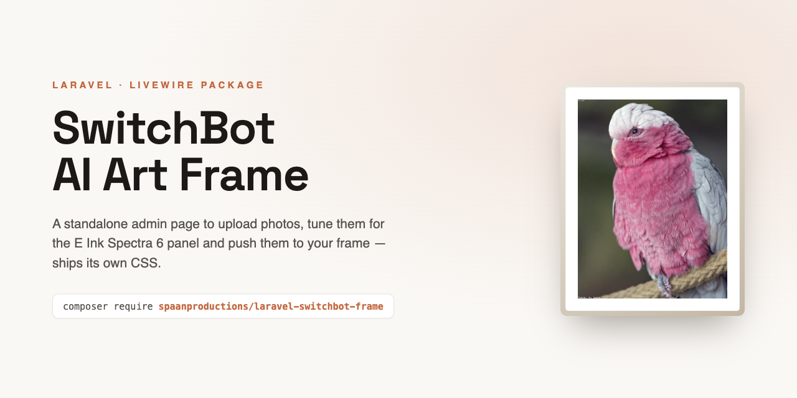
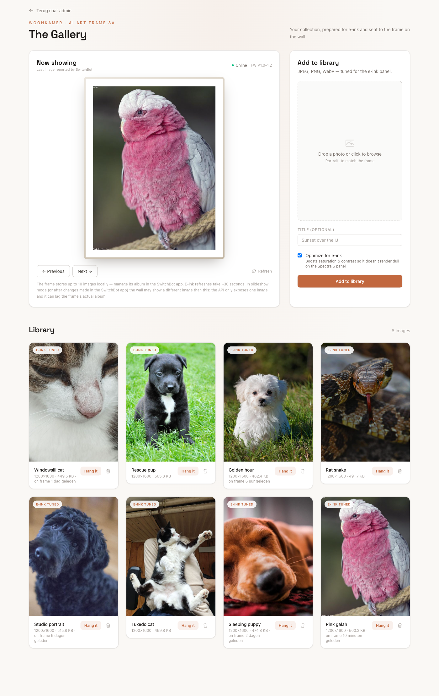

# Laravel SwitchBot AI Art Frame



A standalone Laravel + Livewire admin page for the [SwitchBot AI Art Frame](https://eu.switch-bot.com/products/switchbot-ai-art-frame).
Upload photos, optimize them for the E Ink Spectra 6 panel, push them to the frame, and read the real
battery level from SwitchBot's change-report webhook — all from one self-contained page that ships its
own compiled CSS, so it does not depend on your application's Tailwind build.

## Requirements

- PHP 8.4+
- Laravel 12, Livewire 4
- `ext-gd` (image optimization); `ext-exif` recommended (phone-photo orientation)
- `laravel/sanctum` for the default `auth:sanctum` middleware (or change the middleware in the config)
- A **SwitchBot Hub** (Hub Mini or Hub 2) paired with the frame

> [!NOTE]
> This package controls the frame through SwitchBot's **Cloud API**, so a **SwitchBot Hub** is required
> to work remotely — the Hub bridges the AI Art Frame to the SwitchBot cloud. Without a Hub, the Cloud
> API cannot reach the frame.

## Installation

```bash
composer require spaanproductions/laravel-switchbot-frame

# publish the migrations into your app, then run them
php artisan vendor:publish --tag=switchbot-frame-migrations
php artisan migrate
```

Add your SwitchBot Open API credentials to `.env` (Profile → Preferences → tap *App Version* ~10× in
the SwitchBot app to unlock Developer Options):

```dotenv
SWITCHBOT_TOKEN=
SWITCHBOT_SECRET=
SWITCHBOT_DEVICE_ID=        # optional — auto-discovers the first AI Art Frame if empty
SWITCHBOT_DISK=s3
SWITCHBOT_WEBHOOK_TOKEN=    # long random string, verifies incoming webhook calls
```

The page is served at `/switchbot` by default and **requires login** — it ships with
`['web', 'auth:sanctum']` route middleware. Add any further authorization (roles, gates, a super-admin
guard) via the config (see Configuration).

## Configuration

Publish the config to change the URL, middleware, disk, preview aspect ratios, and the back-link:

```bash
php artisan vendor:publish --tag=switchbot-frame-config
```

```php
// config/switchbot.php
'routes' => [
    'prefix' => 'switchbot',
    'middleware' => ['web', 'auth:sanctum'], // add further authorization here
    'webhook' => ['prefix' => '', 'middleware' => ['api']],
],

'back_link' => ['label' => 'Back', 'url' => null], // shown only when url (or route) is set

'aspect' => [
    'now_showing' => 'portrait',   // portrait | landscape | square
    'dropzone' => 'portrait',
],
```

## Standalone CSS

Out of the box the page loads a pre-compiled Tailwind stylesheet from the package route
`route('switchbot.assets.css')` — no host build step required. Publish it to have the web server serve
it statically instead (faster, and lets you tweak the compiled file):

```bash
php artisan vendor:publish --tag=switchbot-frame-assets
```

Once it exists at `public/vendor/switchbot/app.css`, the page links to it directly and the route serves
it too — so your published (or customized) copy always wins.

## Customizing the layout

Every layout partial (`head`, `styles`, `header`, `scripts`) and the Livewire views are publishable and
overridable:

```bash
php artisan vendor:publish --tag=switchbot-frame-views
```

Edit `resources/views/vendor/switchbot/partials/head.blade.php` to add SEO/meta/favicons, or
`.../partials/styles.blade.php` to change the accent colour and fonts.

## Battery webhook

The status API reports the battery stuck at 0%, so the real level comes from SwitchBot's change-report
webhook. Register this app's public HTTPS receiver:

```bash
php artisan switchbot:webhook          # register
php artisan switchbot:webhook --list   # list registered
php artisan switchbot:webhook --delete # remove
```

## Screenshot



## License

Licensed under the [Apache License, Version 2.0](LICENSE) © [Spaan Productions](https://spaanproductions.nl).
